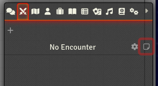
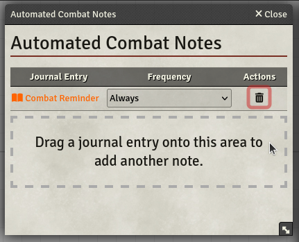
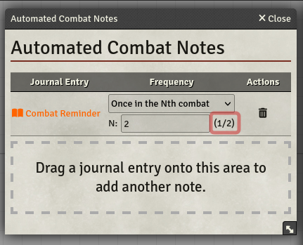
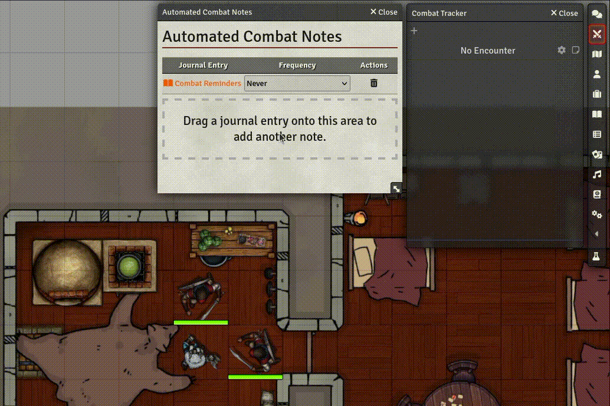

# FoundryVTT Module Automated Combat Notes

A Foundry VTT module that allows GMs and players to specify journal entries that get opened automatically once
combat starts. Useful for anyone who keeps forgetting special rules or circumstances (such as temporary bonuses or
disadvantages) or for anyone who keeps forgetting for the assassin to arrive in the second round of the next combat.

## Installation

You can install the module in Foundry or Forge by searching for "Automated Combat Notes".

### Manually

To install the module manually, follow these steps:
1. Navigate to [Releases](https://github.com/jagoe/fvtt-module-automated-combat-notes/releases)
2. Pick the release you wish to use and download the asset `module.zip`
3. Extract the contents of the archive into a directory called `fvtt-module-automated-combat-notes`  in your Foundry
   server's `Data/modules` directory

## Features

The module allows you to specify a list of journal entries and a frequency mode for each. It then opens any of those
entries according to their frequency whenever a combat starts.

### Opening the note overview

To open the note overview, navigate to the "Combat Encounters" tab in the sidebar on the right and click on the
note icon at the top.

Alternatively, you can use the built-in (and configurable) keybinding `ALT + J` to toggle the overview.

### Adding journal entries

To add journal entries, drag them from anywhere (the journal tab, the chat, [Quick Insert](https://gitlab.com/fvtt-modules-lab/quick-insert), and so on) onto the drop area.

You can add the following note types this way:

* Standard Foundry journal entries
* Journal entry pages
  * Drag and drop the page from the journal entry's page table of contents
* Journal entry headings
  * Drag and drop the heading from the journal entry's page table of contents
* [Monk's Enhanced Journal](https://github.com/ironmonk88/monks-enhanced-journal) entries

This will work for entries that are stored within your world, as well as for entries in a compendium.

### Removing entries

To remove an entry, click the corresponding trashcan icon in the `Actions` column of the entry.

This will remove the journal entry from the combat notes list, but not delete it from Foundry.

### Setting the frequency

By default, each entry will have a frequency of `Always`. You can change each entry's frequency by using the dropdown
list in its `Frequency` column. The following frequency modes exist:

* __Always__: The note will be opened at the start of every combat.
* __Once__: The note will be opened at the start of the next combat, after which its frequency will be set to `Never`.
* __Once in the Nth combat__: The note will be opened in the `nth` combat, determined by the value you enter in the
  input field. For example, a `2` will mean that the note gets opened in the combat after the next. Afterwards, its frequency will be set to `Never`.
* __Every Nth combat__: The note will be opened every `nth` combat. For example, a value of `2` means the note will be
  opened every other combat.
* __Never__: The note will never be opened at combat start.

### Specifying N

If you pick `Once in the Nth combat` or `Every Nth combat`, an input field will appear in which you can enter the
value of `N`.\
Next to the input field you will find a counter that will help you determining how many combats out of the necessary
`n` combats have already occurred.

### Automated display of combat notes

Once you are done setting up your notes, they will now be displayed based on their frequency once combat starts.

### Ownership

Each user has their own list of combat notes that no other user can see or use.

## Running tests

You can run tests in Foundry by following these steps:

1. Install the Foundry module [Quench](https://github.com/Ethaks/FVTT-Quench)
2. Run `npm run build:tests` or `npm run watch:tests`
3. Copy or link the contents of the `dist` folder into a module folder named `fvtt-module-automated-combat-notes`
4. Run Foundry and start up a new world
5. Sign in as a user without any existing combat notes
6. Activate the modules `Automated Combat Notes` and `Quench`
7. Click on the button labeled "QUENCH" at the bottom of the sidebar on the right
8. Click on the button labeled "Run" in the Quench window
